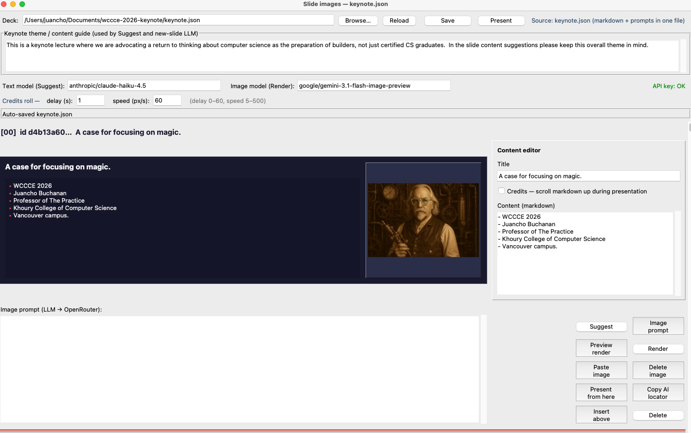
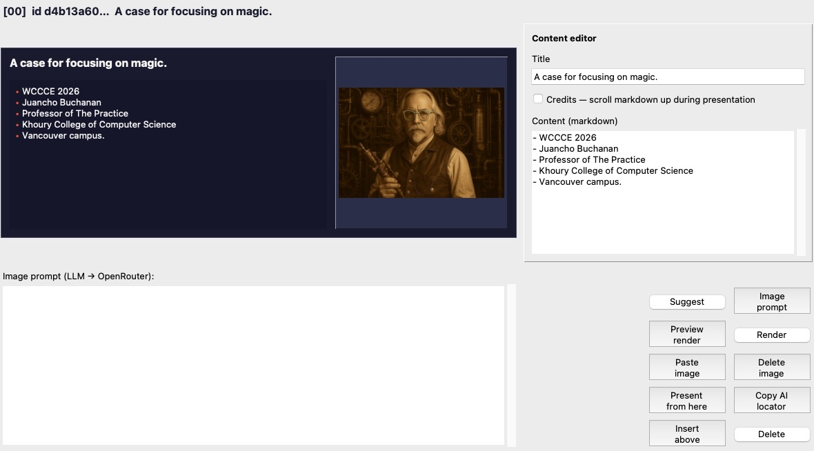
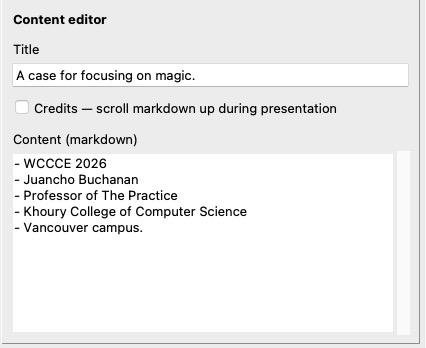
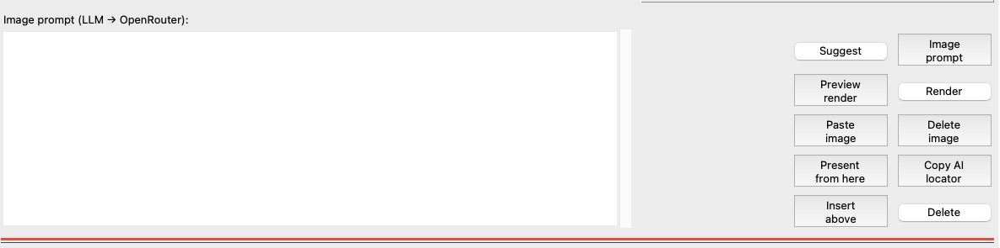
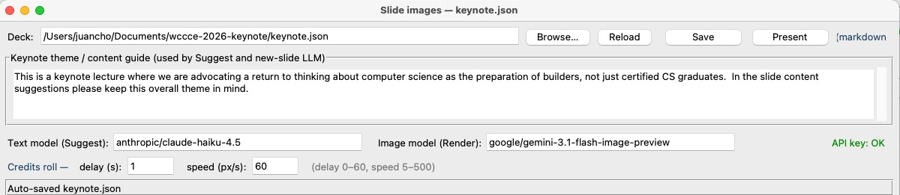
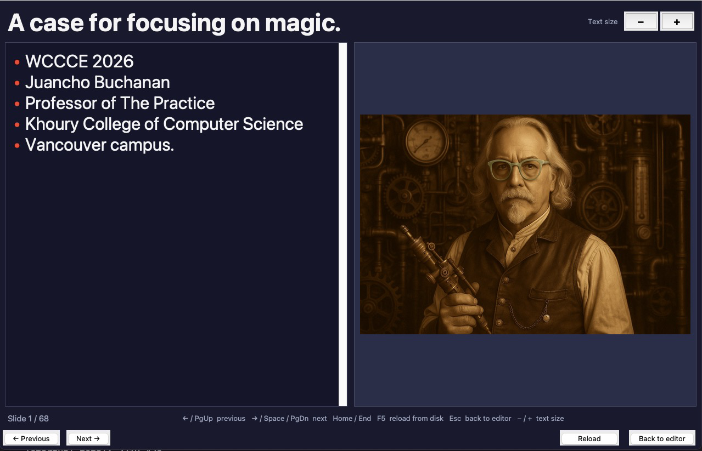
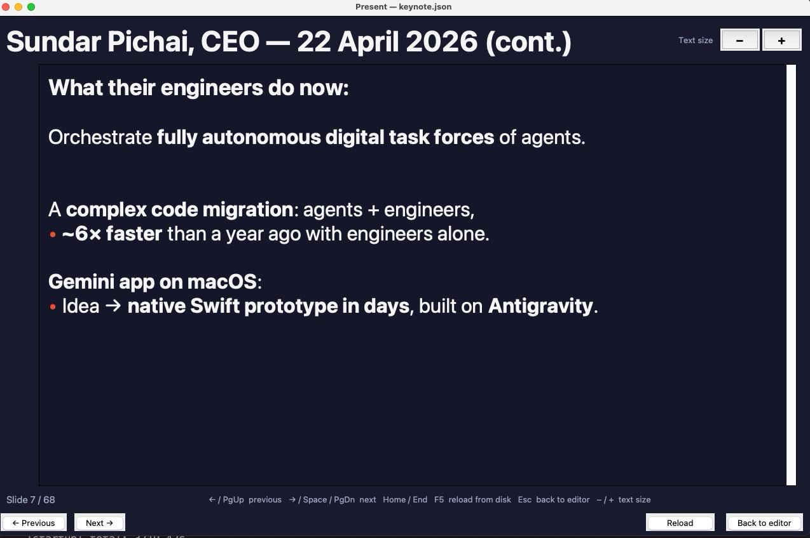
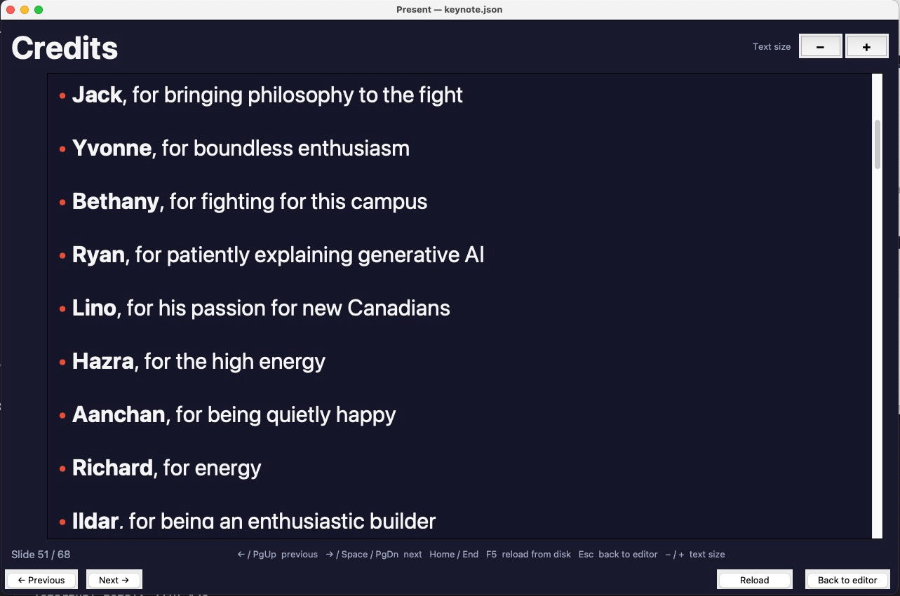

# WCCCE 2026 Keynote Slide Editor

A Tk-based slide editor for building, illustrating, and presenting keynote decks — built entirely through conversational programming.



## What Is This?

This is a desktop slide editor built for the **WCCCE 2026 keynote lecture**, *"Bringing Big into the Classroom: Spells and Craft — What Conversational Programming Opens for Our Students."*

The entire tool — editor, presenter, image pipeline — was built through **conversational programming** with AI assistants. The repository is the companion artifact to the talk: a real, working application you can open, explore, and fork, showing what iterative human–AI collaboration looks like in practice.

What it does:

- **Edit slides** in a scrollable Tk interface — title, markdown body, image prompt per slide, all backed by a single `keynote.json` file.
- **Generate illustrations** via the OpenRouter API — write a prompt (or let the LLM suggest one), preview a quick render, then commit the final image.
- **Present** your deck in a fullscreen (or windowed) presenter with keyboard navigation, adjustable font size, and scrolling credits.

## Quick Start

### Prerequisites

- **Python 3.10+** (any recent 3.x should work; tested on 3.12)
- **Tkinter** — ships with most Python installations. On Ubuntu/Debian: `sudo apt install python3-tk`.

### Install dependencies

```bash
pip install Pillow python-pptx
```

`Pillow` is used for image thumbnails and clipboard paste in the editor. `python-pptx` is only needed if you want to export to PowerPoint.

### Set up an OpenRouter API key (optional — needed for image generation)

The editor can generate slide illustrations through the [OpenRouter](https://openrouter.ai/) API. Provide your key in one of two ways:

1. **Environment variable:**

   ```bash
   export OPENROUTER_API_KEY="sk-or-v1-your-key-here"
   ```

2. **Key file** — create a `.env/` directory in the repo root and add a file called `OpenRouter.md`. Put your key on a line by itself:

   ```
   .env/
   └── OpenRouter.md
   ```

   The contents of `OpenRouter.md` should be:

   ```
   sk-or-v1-your-key-here
   ```

   Or in `KEY=VALUE` format:

   ```
   OPENROUTER_API_KEY=sk-or-v1-your-key-here
   ```

   The `.env/` directory is already in `.gitignore`, so your key will never be committed. The editor also checks `openrouterkey.md` and `OpenRouterKey.md` as alternative filenames.

If no key is configured the editor still works — you just can't generate or preview images.

### Launch the editor

```bash
python slide_editor.py --deck keynote.json
```

### Launch standalone presenter mode

```bash
python slide_editor.py --present --deck keynote.json
```

### Optional CLI flags

| Flag | What it does |
|---|---|
| `--present-windowed` | Open the presenter in a normal window instead of fullscreen. |
| `--debug` | Enable scroll/button probe logging and slide-build timing (writes to `scroll_debug.log`). |
| `--profile-startup` | Run `cProfile` from first slide build through thumbnail queue; prints stats to stderr and writes `slide_editor_startup.prof`. |
| `--profile-startup-exit` | Same as `--profile-startup`, then exits automatically after writing the profile (handy for `py-spy`). |

## The Deck Format

Everything lives in a single JSON file (by default `keynote.json`). The editor reads and writes this file; you can also hand-edit it.

### Top-level keys

| Key | Type | Purpose |
|---|---|---|
| `version` | `int` | Deck format version (currently `1`). |
| `frontmatter` | `object` | Metadata — `title`, `subtitle`, `author`, `footer`. Used by the PowerPoint exporter. |
| `slides` | `array` | Ordered list of slide objects (see below). |
| `text_model` | `string` | OpenRouter model ID for the **Suggest** LLM (e.g. `"anthropic/claude-haiku-4.5"`). |
| `model` | `string` | OpenRouter model ID for **Render** image generation (e.g. `"google/gemini-3.1-flash-image-preview"`). |
| `output_directory` | `string` | Where slide images are stored (default `"slide_images"`). |
| `global_style_file` | `string` | Path to the global image style prompt (default `"global_style.md"`). |
| `width` / `height` | `int` | Pixel dimensions for generated images (default `1024 × 1024`). |
| `credits_start_delay_seconds` | `float` | Seconds to wait before credits start scrolling (0–60, default `1.0`). |
| `credits_scroll_pixels_per_second` | `float` | Scroll speed for credits slides (5–500, default `60.0`). |

### Slide object fields

Each entry in the `slides` array is an object with these fields:

| Field | Type | Description |
|---|---|---|
| `id` | `string` | Stable UUID — generated once, never changes. Image files are named after this. |
| `kind` | `string` | `"content"`, `"title"`, or `"quote"` — affects PowerPoint export layout. |
| `markdown` | `array` | Full slide content in markdown. Rendered in the presenter and used for PPTX export. |
| `title` | `array` | Short slide title shown in the editor's slide card. |
| `body` | `array` | Slide body text — used by the LLM for context when suggesting prompts. |
| `image_prompt` | `string` | The prompt sent to the image model when you click Render. |
| `credits` | `boolean` | When `true`, the presenter shows this slide as a full-width scrolling credits roll. |

### Array-of-strings text format

The `markdown`, `title`, and `body` fields are stored as **JSON arrays with one element per line** rather than a single string with embedded `\n` characters. This makes diffs cleaner and the JSON easier to read:

```json
"markdown": [
  "# Slide Title",
  "",
  "- First point",
  "- Second point",
  "- Third point"
]
```

The editor handles the conversion automatically — you see and edit plain text; the file stores arrays.

### A representative slide

```json
{
  "id": "d4b13a60-7827-4c7c-b905-fd953a8dbde1",
  "kind": "content",
  "markdown": [
    "# A case for focusing on magic.",
    "",
    "- WCCCE 2026",
    "- Juancho Buchanan",
    "- Professor of The Practice",
    "- Khoury College of Computer Science",
    "- Vancouver campus."
  ],
  "title": [
    "A case for focusing on magic."
  ],
  "body": [
    "- WCCCE 2026",
    "- Juancho Buchanan",
    "- Professor of The Practice",
    "- Khoury College of Computer Science",
    "- Vancouver campus."
  ],
  "image_prompt": "",
  "credits": false
}
```

### Image path convention

Slide images are stored as `slide_images/{id}.png` — the filename is the slide's UUID, not its position in the array. This means you can **reorder slides** in the JSON (or in the editor) without breaking any image references. Thumbnails are cached in `slide_images/.thumbs/` and regenerated automatically when the source image changes.

## Editor Walkthrough

The editor window is a vertically scrollable list of **slide cards** — one per slide in your deck. Each card gives you a compact overview; click a card to expand its full editing panel.

### Slide cards



Each slide card shows three things at a glance:

- **Title preview** — the slide's title rendered in bold at the top of the card.
- **Markdown body preview** — a read-only rendering of the slide's markdown content, with basic formatting (headings, bold, italic, lists).
- **Image thumbnail** — a 240 px preview of the slide's generated image on the right side of the card. If no image exists yet, this area is empty.

Cards are numbered by position in the deck. The dark background mirrors the presentation palette so you get a rough sense of how the slide will look on screen.

### Content editor



Click a slide card to reveal the **content editor** on the right side. It contains:

- **Title** — a text input for the slide's short title (shown in the card and used as context for LLM suggestions).
- **Credits checkbox** — *"Credits — scroll markdown up during presentation"*. Check this to turn the slide into a scrolling credits roll in presenter mode.
- **Content (markdown)** — a scrollable text area where you write the slide's full markdown body. Changes are autosaved.

### Image prompt and action buttons



Below the slide card, an **image prompt** text area lets you write (or edit) the prompt that will be sent to the image generation model. Next to it is a **2×5 grid of action buttons**:

| Button | What it does |
|---|---|
| **Suggest** | Opens a dialog where you can ask the LLM to edit the slide's title, body, and markdown. You describe what you want changed in plain language, review a diff-style preview, and accept or reject. |
| **Image prompt** | Asks the LLM to generate an image prompt based on the slide's content and the global style. The result is placed in the image prompt text area for you to review and edit. |
| **Preview render** | Sends the prompt to a fast, lower-cost model for a quick visual check before committing to a full render. |
| **Render** | Generates the final slide image using the selected image model and saves it as `slide_images/{id}.png`. |
| **Paste image** | Imports an image from your system clipboard and saves it as this slide's image (replacing any existing one). You can also use `Ctrl+V` / `Cmd+V`. |
| **Delete image** | Removes the slide's generated image file from disk. |
| **Present from here** | Opens the presenter starting at this slide — handy for checking how a single slide looks full-screen. |
| **Copy AI locator** | Copies a context string identifying this slide (with neighbors) to the clipboard, useful for pasting into an AI assistant conversation. |
| **Insert above** | Adds a new blank slide immediately above this one. |
| **Delete** | Removes this slide from the deck (with confirmation). |

### Toolbar



The toolbar at the top of the editor window contains:

- **Deck path** and **Browse…** / **Reload** / **Save** buttons — open a different deck, reload from disk, or force-save.
- **Present** button — opens the presenter in a window (same as running `--present` from the command line, but embedded so you return to the editor when you close it).
- **Text model selector** — the OpenRouter model used by **Suggest** (e.g. `anthropic/claude-haiku-4.5`).
- **Image model selector** — the OpenRouter model used by **Render** (e.g. `google/gemini-3.1-flash-image-preview`).
- **API key status** — shows "API key: OK" in green if a key is configured, or "API key: missing" in red.
- **Credits roll timing** — delay (seconds before scrolling starts) and speed (pixels per second). These apply to all credits slides in the deck.

## Presenter Mode

The presenter is a read-only, dark-themed view designed for delivering your talk. Launch it from the toolbar's **Present** button (opens in a window, returns to the editor on close) or from the command line with `--present` (fullscreen by default).

### Two layouts

The presenter picks a layout based on whether the current slide has a generated image:

- **Markdown + image** — text on the left, image on the right, each taking roughly half the screen.

  

- **Full-width markdown** — when there is no image (or the slide is a credits slide), the markdown fills the entire width.

  

### Keyboard shortcuts

| Key | Action |
|---|---|
| `←` / `PgUp` / `↑` | Previous slide |
| `→` / `Space` / `PgDn` / `↓` | Next slide |
| `Home` | Jump to first slide |
| `End` | Jump to last slide |
| `F5` | Reload deck from disk (picks up external edits without restarting) |
| `Escape` | Exit fullscreen, or quit the presenter |
| `−` (minus) | Decrease text size |
| `+` (plus) | Increase text size |

Navigation buttons (← Previous, Next →, Reload, Back to editor / Quit) are also available at the bottom of the window.

### Font size

Use the **−** / **+** keys (or the on-screen buttons) to adjust the presenter's body text size. The range is 9 pt to 30 pt, and your choice is **persisted in `settings.json`** so it carries across sessions. The title size scales proportionally.

## Image Generation

Every slide can have an AI-generated illustration. The pipeline goes through [OpenRouter](https://openrouter.ai/), so you can choose from a range of image models without managing separate API keys.

### The workflow

1. **Write a prompt** in the image prompt text area — describe what you want the illustration to show.
2. **Image prompt** (optional) — click this button to let the LLM draft a prompt for you based on the slide's content and the global style. Review and edit the result.
3. **Preview render** — sends the prompt to a quick, lower-cost render so you can check composition before committing.
4. **Render** — generates the final image at full resolution (default 1024×1024) and saves it as `slide_images/{id}.png`.

### Configurable models

The image model is set in the toolbar's **Image model** field and stored in the deck's `model` key. The default is `google/gemini-3.1-flash-image-preview`. You can switch to any OpenRouter-supported image model — the editor sends the same prompt format regardless.

The text model (toolbar's **Text model** field, deck key `text_model`) is used by the **Suggest** and **Image prompt** buttons for LLM-powered content editing and prompt generation.

### Global style (`global_style.md`)

The file `global_style.md` in the repo root contains art-direction instructions that are **prepended to every image prompt** automatically. This is where you define the visual language for your entire deck — dimensions, line style, color palette, what to avoid. Edit this file to change the look of all future renders without touching individual slide prompts.

### Paste image

If you already have an image (from another tool, a screenshot, etc.), use **Paste image** or `Ctrl+V` / `Cmd+V` to import it from the clipboard. The image is saved as the slide's `{id}.png`, replacing any existing render.

### Thumbnail cache

The editor generates small thumbnails for the slide list and stores them in `slide_images/.thumbs/`. These are regenerated automatically whenever the source image is newer than the cached thumbnail. The `.thumbs/` directory is in `.gitignore` — you don't need to commit it.

## Slide Management

### Adding and removing slides

- **Insert above** — adds a new blank slide immediately above the current one. The new slide gets a fresh UUID and empty fields.
- **Delete** — removes the slide from the deck after a confirmation prompt. The slide's image file is *not* deleted from disk automatically, so you can recover if needed.

### Reordering slides

The editor doesn't have drag-and-drop reordering (yet). To change slide order, edit the `slides[]` array in `keynote.json` directly — cut and paste the slide object to its new position. Because images are keyed by UUID (not array index), **reordering never breaks image references**.

### Autosave

The editor autosaves to `keynote.json` shortly after you stop typing (title, body, or image prompt changes trigger a save timer). You'll see the status bar update when a save happens.

### External change detection

The editor watches `keynote.json` for modifications by other tools (another editor, `git pull`, a script). When it detects the file has changed on disk, it reloads the deck automatically. In the presenter, press **F5** to manually reload from disk at any time.

## Credits Slides

Any slide can become a scrolling credits roll — useful for acknowledgments, sources, or a closing "thank you" sequence.

### Enabling credits

- **In the editor:** check the *"Credits — scroll markdown up during presentation"* checkbox in the content editor panel.
- **In JSON:** set `"credits": true` on the slide object.

### Scroll timing

Two deck-level settings control the animation (editable in the toolbar's credits roll bar or directly in `keynote.json`):

| Setting | Range | Default | What it controls |
|---|---|---|---|
| `credits_start_delay_seconds` | 0 – 60 | `1.0` | Seconds to wait after the slide appears before scrolling begins. |
| `credits_scroll_pixels_per_second` | 5 – 500 | `60.0` | How fast the text scrolls upward. |

### Presenter behavior

In the presenter, a credits slide is displayed as **full-width markdown** (no side image, even if one exists). After the configured delay, the text begins scrolling upward automatically. Navigating away from the slide cancels the scroll; navigating back restarts it from the top.



## The Conversational Programming Story

This tool was built entirely through **conversational programming** — an iterative process where a human and an AI assistant collaborate through dialogue to design, implement, and refine software.

The workflow looked like this:

1. **Describe** what you want — in plain language, with as much or as little detail as feels right.
2. **Review** the generated code — read it, run it, see what works and what doesn't.
3. **Refine** through follow-up conversation — point out bugs, ask for changes, suggest a different approach, or just say "that's not quite what I meant."
4. **Repeat** — each round builds on the last. Features accumulate, rough edges get smoothed, and the tool grows into something you'd actually use.

No boilerplate was hand-typed. No Stack Overflow tabs were open. The conversation *was* the development environment.

This repository is the **companion artifact** to the WCCCE 2026 keynote lecture. The talk argues that conversational programming changes what's possible for students and builders — and this slide editor is the proof-of-concept: a real, working desktop application built by talking through what it should do, one feature at a time.

### A real example: the human spots what the LLM can't

Early in development, the editor took about 60 seconds to start up with a 50-slide deck. The LLM had built the slide list by creating each `SlideRow` widget one at a time — and after adding each row, it triggered a full rebuild of the scroll region and re-laid out every existing widget. The result was an O(n²) startup: each of the 50 slides caused all previous slides to be re-measured and repositioned.

The LLM didn't see the problem. It had written each piece of code in isolation — the "add a row" function, the "update scroll region" function — and each piece was correct on its own. The quadratic behavior only emerged from how they composed at scale.

The human noticed the startup was slow, profiled it, and said: *"I think there's some sort of O(n²) thing happening — each slide is being added and then the whole deck is being rebuilt."*

That one observation was enough. The LLM immediately understood the issue, restructured the code to batch-build all rows before updating the scroll region, and deferred thumbnail loading to an idle queue. Startup dropped from ~60 seconds to under 2 seconds.

This is the pattern that makes conversational programming work: the human brings intuition, taste, and the ability to notice when something *feels* wrong. The LLM brings the ability to restructure hundreds of lines of code in seconds once the problem is identified. Neither could have solved it alone as quickly.

## Forking and Customization

This tool isn't locked to one talk. Fork the repo and make it yours.

### Create a new deck

Start with a minimal `keynote.json`:

```json
{
  "version": 1,
  "frontmatter": {
    "title": "Your Talk Title",
    "subtitle": "",
    "author": "Your Name",
    "footer": "Conference 2026"
  },
  "slides": [],
  "text_model": "anthropic/claude-haiku-4.5",
  "model": "google/gemini-3.1-flash-image-preview",
  "output_directory": "slide_images",
  "global_style_file": "global_style.md",
  "width": 1024,
  "height": 1024
}
```

Then open it in the editor and use **Insert above** to add slides.

### Customize the visual style

Edit `global_style.md` to change the art direction for all generated images. The current file defines an XKCD-style black-and-white line drawing aesthetic — replace it with whatever suits your talk.

### Export to PowerPoint

```bash
python generate_slides.py --input keynote.json --output slides.pptx --images slide_images/
```

This builds a `.pptx` file with your slide content and images. The exporter uses the `kind` field to pick layouts (title slides, content slides, quote slides).
